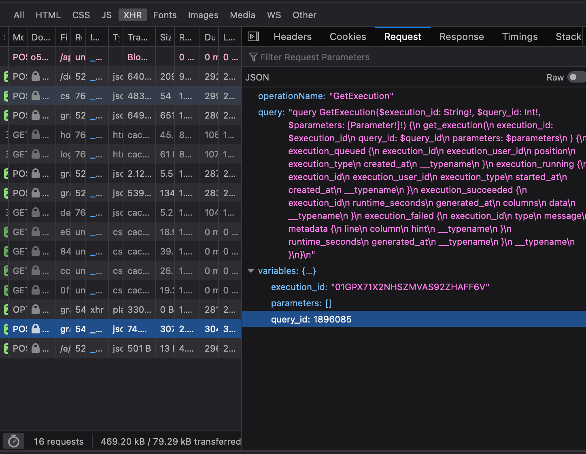

# NOTE: Don't work anymore

# dune-query-export

Export your dune query to csv

## Get Started

Clone the repo and install dependencies

```shell
git clone https://dune.com/queries/1895898/3120845
pnpm install
```

Find the arguments in your query board in the browser console

For example: https://dune.com/queries/1896085/3121023



The execution_id is `01GPX71X2NHSZMVAS92ZHAFF6V`, query_id is `1896085`.

Replace the `execution_id` and `query_id` in `src/index.ts`. Then run command to export

```shell
pnpm start
```


